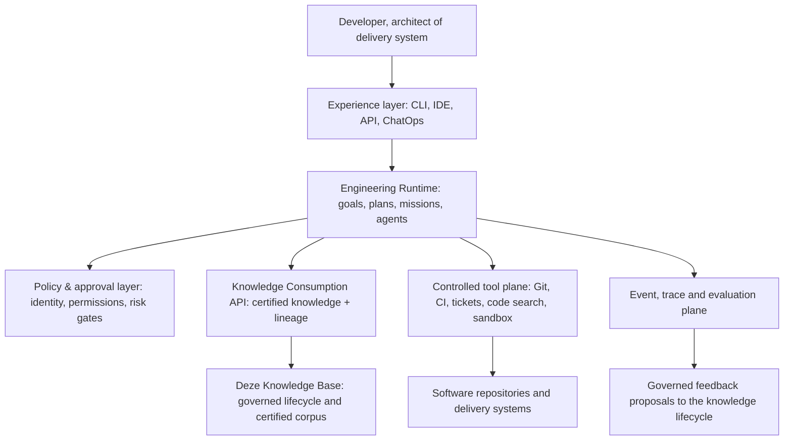

# Status-, werking- en capabilityverslag: startpunt voor een AI Engineering Platform

## Doel en conclusie

Dit verslag beoordeelt de repository als vertrekpunt voor een werkelijk AI Engineering Platform voor softwareontwikkeling. De beoordeling is uitgevoerd op 31 juli 2026 op basis van de repositoryinhoud en het gedrag van de meegeleverde CLI.

**Conclusie:** dit project is een sterk en relatief volwassen **Knowledge Operating System** met een kleine, werkende lifecycle-CLI. Het is geschikt als de governance-, kennis- en traceability-laag van een toekomstig platform. Het is **nog geen uitvoerend AI Engineering Platform**: agentuitvoering, capability-registratie, goal/mission orchestration, beveiligde tooltoegang, integraties met de SDLC en platformobservability zijn bewust alleen als architectuur beschreven.

De juiste strategische keuze is daarom: behoud deze repository als onafhankelijke canonieke kennisbron en bouw de runtime als een afzonderlijke productlaag die deze knowledge base read-only consumeert. Maak de knowledge base niet tot de runtime, en verander de runtime ook niet in de bron van waarheid voor engineeringkennis.

## Managementsamenvatting

| Onderwerp | Huidige status | Betekenis voor de platformarchitect |
| --- | --- | --- |
| Kennismodel en governance | Sterk, gedocumenteerd en gevalideerd | Direct herbruikbaar als authority- en traceability-model. |
| Kennislevenscyclus | Werkend voor onboarding tot certificering | Bruikbaar als gecontroleerde feedbackloop vanuit runtime-resultaten. |
| Kennisbestand | 3 bronnen, 98 observaties, 106 kandidaten, 24 concepten, 20 gegeneraliseerde en 20 gecertificeerde kennisitems | Betrouwbare pilot-corpus, maar inhoudelijk nog smal voor generieke softwareontwikkeling. |
| CLI | 14 commando’s uitvoerbaar | Goede referentie-implementatie voor lifecycle-operaties; geen product-CLI voor developers. |
| Retrieval/assistent | Werkend, read-only en traceable | Geschikt als eerste deterministische retrieval-laag; nog geen semantische RAG- of LLM-dienst. |
| Multi-agent, capabilities, goals en missions | Ontworpen, niet geïmplementeerd | Dit is de primaire productbouwopgave. |
| Kwaliteit | Repositoryvalidatie: 0 bevindingen; tests: 6 geslaagd | Goede interne consistentie, maar onvoldoende bewijs voor runtimeveiligheid of product-SLO’s. |

De grootste waarde zit niet in een modelkeuze of een chatbot. Zij zit in de expliciete scheiding tussen **bewijs**, **voorstel**, **gecertificeerde kennis**, **afgeleide output** en **menselijke beslissingsbevoegdheid**. Dat is precies de discipline die nodig is wanneer AI engineeringwerk op schaal ondersteunt.

## Wat er vandaag daadwerkelijk werkt

### 1. Canonieke knowledge lifecycle

De repository implementeert en documenteert een strikt, eenrichtingsmodel:

```text
Software-repository / engineeringbron
  -> observatie
  -> kennis-kandidaat
  -> kennisconcept
  -> gegeneraliseerde kennis
  -> gecertificeerde kennis
  -> afgeleide publicatie of engineeringoutput
```

Elke fase heeft een eigen opslaglocatie, identiteit en traceability. Bronnen blijven read-only; alleen de knowledge base ontvangt afgeleide observaties en voorstellen. Dit voorkomt dat project-specifieke implementaties per ongeluk als organisatiebrede waarheid worden behandeld. Zie [de kernmissie](../README.md), [het lifecyclemodel](../lifecycle/README.md) en [het kennismodel](../model/README.md).

De huidige voorraad volgens `aikb stats` is:

| Lifecyclelaag | Aantal |
| --- | ---: |
| Actieve Knowledge Sources | 3 |
| Engineering Observations | 98 |
| Knowledge Candidates | 106 |
| Knowledge Concepts | 24 |
| Generalized Knowledge | 20 |
| Certified Knowledge | 20 |
| Publicaties | 4 |

De validatie rapporteert 272 knowledge objects, 100% certificeringsdekking van gegeneraliseerde kennis, volledige traceability voor de publicaties en nul bevindingen. Dit zegt dat de **repositorystructuur** consistent is; het is geen onafhankelijke uitspraak over de inhoudelijke juistheid of volledigheid van het corpus.

### 2. Uitvoerbare lifecycle-CLI

De CLI bevat 14 geregistreerde, uitvoerbare commando’s:

| Groep | Commando’s | Gedrag |
| --- | --- | --- |
| Bron en kennisvorming | `onboard`, `extract`, `classify`, `review`, `generalize`, `certify` | Schrijft lifecycle-records in de knowledge base; wijzigt geen geregistreerde bronrepository. |
| Kennisconsumptie | `ask`, `generate`, `evolve` | Beantwoordt vragen of maakt afgeleide engineeringprogramma’s; `evolve` is standaard read-only. |
| Besturing en kwaliteit | `init`, `validate`, `improve`, `status`, `stats` | Bootstrap, validatie, verbetering en transparante status/statistiek. |

De implementatie gebruikt een dunne Python-CLI met de standaardbibliotheek. `ask` leest gecertificeerde Markdown-records, selecteert items met een deterministische token/veldscore en levert de bijbehorende evidence- en lifecycleverwijzingen mee. Dat is uitlegbaar en voorspelbaar, maar geen semantische zoekdienst en geen LLM-gebaseerde engineer.

`extract` kloont een geregistreerde Git-bron shallow, vindt een beperkte set Markdown-evidence op bestandsnaam/locatie en maakt observatierecords. Dit bewijst de keten, maar de extractie is nog documentgericht en niet ingericht voor code, tickets, pull requests, CI-resultaten, security-vindings of runtime-telemetrie.

### 3. Governance, assurance en traceability

De repository heeft een opvallend compleet conceptueel fundament: classificatie, retrieval, synthese, automation, knowledge quality, qualification, operating model, source onboarding, review/promotie, certificering en AI-operations zijn beschreven. Vooral de volgende invarianten moeten worden behouden:

- Alleen Certified Knowledge is canonieke engineeringautoriteit.
- AI mag analyseren, voorstellen, genereren en rapporteren; AI mag niet certificeren, governance wijzigen of stilzwijgend autoritatieve beslissingen nemen.
- Engineeringresultaten moeten herleidbaar blijven van agent/resultaat naar Certified Knowledge, generalisatie, concept, kandidaat, observatie, bron en evidence.
- Publicaties en gegenereerde artefacten zijn afgeleid en nooit de primaire bron van waarheid.

Dit sluit goed aan op enterprise-eisen rond auditability, verantwoord AI-gebruik en change control.

## Wat slechts ontworpen is — en dus nog niet beschikbaar

De repository documenteert 37 architecture-only/placeholder-commando’s. De belangrijkste productgaten zijn:

| Ontworpen capability | Huidige realiteit | Wat moet er gebouwd worden |
| --- | --- | --- |
| Multi-Agent Engineering Runtime | Rollen, contracten, traceability en orchestration modes zijn beschreven | Agent registry, scheduler, taakmodel, durable run state, result store, retries en human checkpoints. |
| Capability Extension Framework | Capability lifecycle en metadata zijn beschreven | Registry, manifest/schema, dependency resolver, versiebeheer, policy-validatie en activation. |
| Goal-driven orchestration | Goal-, capability graph- en planmodel zijn beschreven | Goal interpreter, planner, constraint solver, plan-explainability en approval flow. |
| Mission Runtime | Mission states, checkpoints en rapportage zijn beschreven | Persistente state machine, idempotency, cancellation, escalation, event log en operatorervaring. |
| Qualification Runtime | Scorecards en qualificationconcepten zijn beschreven | Executable controls, evidence collectors, control mapping en decision workflow. |
| Developer platformintegratie | Niet aanwezig | Git-provider, issue tracker, CI/CD, artifact registry, secrets, IDE/ChatOps en identity-integraties. |
| Model/platformlaag | Niet aanwezig | Model gateway, provider routing, prompt/version registry, evals, guardrails, caching, budgetbeheer en redaction. |

De CLI-status is hierin leidend: een gedocumenteerd commando is geen beschikbaar platformoppervlak zolang het niet in de parser en runtime is geregistreerd.

## Doelarchitectuur

De aanbevolen doelarchitectuur bestaat uit zes gescheiden lagen. Dit verlaagt coupling, maakt controles testbaar en voorkomt dat agentcode kennis- of governancebeslissingen verbergt.



### A. Knowledge Base en Consumption API

Behoud deze repository als versioned source-of-truth. Voeg een read-only Consumption API toe die versie-gebonden retrieval, filters op domein/risico/status, relationship traversal, evidence-citatie en policy-aware contextbundels levert. Start met Markdown/Git als authoringformaat, maar bouw een indexeringsprojectie voor zoekprestaties. Een index is afgeleid en reproduceerbaar; Git/Markdown blijft de canonieke laag.

### B. Engineering Runtime

Implementeer eerst een smalle runtime voor één bounded workflow, bijvoorbeeld: “analyseer een pull request, maak een verification plan en open alleen na menselijke goedkeuring een commentaar.” Een run moet een immutable run-id, doel, geselecteerde capabilityversies, knowledge snapshot/references, toolcalls, modelinputs/-outputs, kosten, risico-classificatie, approvals en artefactreferenties hebben.

### C. Tool plane en sandboxing

Alle externe acties lopen via typed tool contracts en least-privilege credentials. Splits read-, propose- en write-acties. Write-acties mogen alleen een expliciet, policy-gecheckt voorstel of pull request maken; geen directe default-branch mutaties. Gebruik geïsoleerde workspaces/sandboxes voor code-uitvoering, scan outputs op secrets en houd volledige auditlogs bij.

### D. Model- en evaluatieplatform

Introduceer een model gateway, geen directe providercalls vanuit capabilities. De gateway verzorgt identiteit, tenant/repository-context, toegestane modellen, data-classificatie, redactie, rate/budget limits en observability. Maak evaluaties een release-gate: golden tasks per capability, tool-use tests, traceability-completeness, security/prompt-injection tests, regressietests en menselijke kwaliteitsbeoordeling.

### E. Control plane

Een control plane beheert registraties en levenscycli voor capabilities, agents, model policies, connectoren en evaluaties. De control plane is niet hetzelfde als de knowledge-governance: hij beheert uitvoerbaarheid en risico; de knowledge governance blijft bepalen wat autoritatieve engineeringkennis is.

### F. Observability en feedback

Leg events vast voor planvorming, retrieval, toolcall, approval, output, fout en evaluatie. Bouw dashboards voor doorlooptijd, approval-rate, tool failures, hallucination/grounding findings, kosten, adoption, traceability coverage en outcomekwaliteit. Feedback uit productieruns gaat als **proposal/evidence** terug de lifecycle in, nooit rechtstreeks naar Certified Knowledge.

## Kritische risico’s en architectuurkeuzes

| Risico | Waarom dit nu relevant is | Richting |
| --- | --- | --- |
| Architectuur wordt gezien als product | 37 toekomstige commando’s kunnen ten onrechte als beschikbare functies worden gelezen | Publiceer een machineleesbare feature/capability maturity matrix en houd “conceptual” uit de product-API. |
| Corpus is te klein en brondiversiteit beperkt | 20 gecertificeerde items uit 3 bronnen dekken vooral DJConnect-afgeleide domeinen | Onboard 3–5 contrasterende softwareportfolio’s en meet coverage per SDLC-domein. |
| String matching als retrieval | Slechte recall, taalafhankelijkheid en geen code/contextbegrip | Voeg hybride retrieval toe; behoud citations en deterministic fallback. |
| Automatische extractie als bewijsinterpretatie | Huidige documentdetectie kan relevante of gevoelige context missen | Zet code/CI/ticket extractors achter expliciete profielen, classificatie en human sampling. |
| Agents met schrijfrechten | Onbedoelde repository-, supply-chain- of gegevensschade | Default read-only; voorstel/PR als enige write-mode, met scopes, approvals en sandbox. |
| Validatie verwarren met platformkwaliteit | Nul repository findings zegt niets over agents, models, security of schaalbaarheid | Scheid knowledge validation, runtime verification, security assurance en product SLO’s. |
| Beperkte testbasis | Er zijn zes unit tests, geconcentreerd rond statistiek | Introduceer contract-, integration-, e2e-, adversarial- en load-tests vóór productiegebruik. |

## Gefaseerde routekaart

### Fase 0 — architectuurcontract en pilotkeuze (0–4 weken)

Leg de boundary tussen repository en runtime formeel vast. Kies één developer journey met meetbaar resultaat en lage schrijfrisico’s. Definieer tenant-, identity-, data-classification-, audit-, retention- en approvalbeleid. Lever tevens JSON/Markdown-schema’s voor Capability, Agent, Run, ToolCall, Approval, Evaluation en TraceabilityRecord.

**Exit:** één door architectuur en security goedgekeurd runtime-contract; een risico-geclassificeerde pilot backlog; baselines voor kwaliteit, kosten en doorlooptijd.

### Fase 1 — governed read-only engineering assistant (1–2 kwartalen)

Bouw Consumption API, hybride index, model gateway, agent/capability registry, event store en een read-only repository/CI connector. Lever één capability, bijvoorbeeld PR-verification planning of release-readiness analysis. Elke output citeert Certified Knowledge en toont onzekerheid, gebruikte evidence en aanbevolen menselijke actie.

**Exit:** reproduceerbare, geëvalueerde read-only runs; minimaal 95% traceability-completeness voor pilotoutputs; geen ongeautoriseerde toolacties; accepted quality target met engineeringgebruikers.

### Fase 2 — planbare workflows met gecontroleerde voorstellen (2–3 kwartalen)

Implementeer planner, mission state machine, approval checkpoints, sandboxed code/tool execution en PR-only writeback. Voeg capability dependency validation, policy enforcement, operatorconsole en incident/runbook toe. Start met maximaal twee aanvullende capabilities.

**Exit:** end-to-end mission van goal naar voorgestelde pull request of engineeringartefact; audit trail compleet; security en reliability gates gehaald; rollback/cancellation aantoonbaar getest.

### Fase 3 — schaalbaar platform en knowledge flywheel (doorlopend)

Voeg multi-tenant isolatie, queue-based execution, concurrentiecontrole, cost governance, SLO’s, connector catalogus, self-service capability onboarding en qualification scorecards toe. Operationaliseer de feedbackroute van run-evidence naar reviewbare knowledge candidates. Breid het corpus uit op basis van bewezen productbehoefte, niet alleen op basis van beschikbare documenten.

## Eerste prioritaire backlog

1. Definieer machineleesbare contracten voor Capability, Agent, Mission, Tool, Approval en Run Trace.
2. Bouw een versiegebonden, read-only Knowledge Consumption API met citations en relationship traversal.
3. Kies en lever één read-only capability met gouden evaluatieset en menselijke scorecard.
4. Richt model gateway, repository identity, secrets isolation, redaction en audit events in.
5. Bouw een event-sourced mission/run store vóór parallelle of autonome agentuitvoering.
6. Voeg sandboxed execution en policy-governed propose/PR writeback toe, pas ná de read-only pilot.
7. Vergroot kennisdekking met diverse repositories en formele coverage/recency-scorecards.
8. Verhoog testdekking van alleen statistics naar alle lifecycletransities en het toekomstige runtime-control plane.

## Besluitadvies

Gebruik deze repository als **foundation**, niet als turnkey platform. Investeer als eerste in een read-only, traceable engineering assistant rond één echte software-deliveryworkflow. Dat maakt de sterkste bestaande eigenschappen — gecertificeerde kennis, lineage en governance — onmiddellijk nuttig, zonder vroegtijdig autonome schrijfrechten of een brede multi-agent-runtime te introduceren.

De architect moet drie beslissingen expliciet nemen voordat implementatie start:

1. Welke pilot workflow krijgt als eerste productverantwoordelijkheid en welk meetbaar bedrijfsresultaat moet zij verbeteren?
2. Welke risico- en data-classificaties bepalen of een agent alleen leest, een voorstel maakt, of een pull request mag openen?
3. Wie is eigenaar van capability governance, runtime operations en knowledge certification — als drie afzonderlijke maar samenwerkende verantwoordelijkheden?

## Beoordelingsbewijs

- [`README.md`](../README.md): missie, scope, lifecycle en canonieke boundaries.
- [`cli/README.md`](../cli/README.md): command model en het onderscheid tussen geïmplementeerde en architecture-only interfaces.
- [`multi-agent-runtime/README.md`](../multi-agent-runtime/README.md): beoogd agent- en orchestrationmodel.
- [`capabilities/README.md`](../capabilities/README.md): beoogd capabilitymodel en lifecycle.
- [`baselines/generation-2/repository-readiness-assessment.md`](../baselines/generation-2/repository-readiness-assessment.md): baselinebesluit voor continue knowledge evolution.
- Uitgevoerd op 31 juli 2026: `aikb status`, `aikb stats`, `aikb validate` en de volledige bestaande unittest-suite. De validatie gaf 0 bevindingen; alle 6 tests slaagden.
